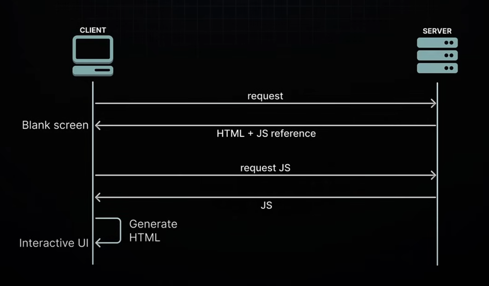
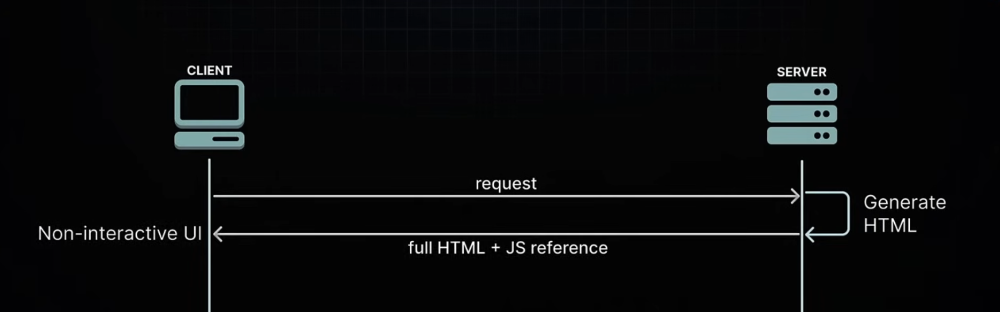
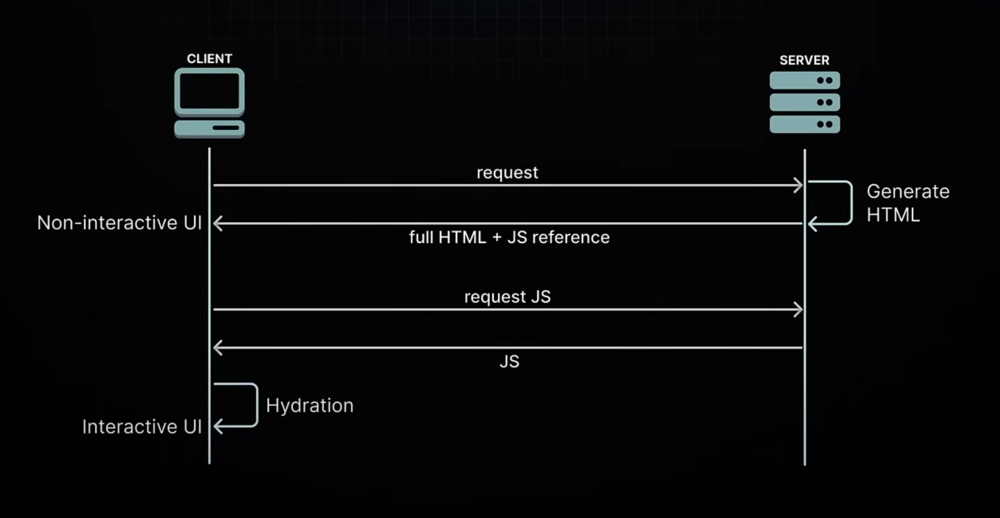
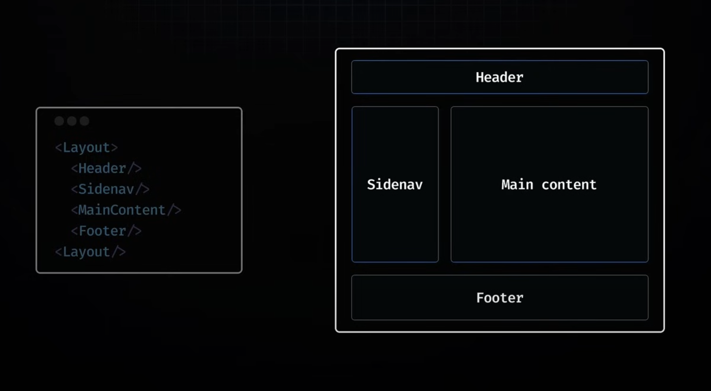
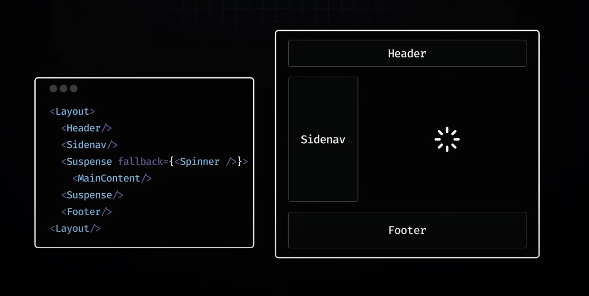

# Next-Js by Codevolution : Part-4

### Topics Covered :

- Rendering
- Client-side Rendering (CSR)
- Server-side Rendering (SSR)
- Suspense SSR
- React Server Components (RSCs)
- Server and Client Components
- Rendering Lifecycle in RSCs
- Static Rendering
- Dynamic Rendering
- generateStaticParams
- dynamicParams

## Rendering

### Introduction to Rendering : 

- Rendering is the process of transforming the component code you write into user interfaces that users can see and interact with.

- In Next.js, the tricky part is to building a performant application is figuring out when and where this transformation should happen.

- CSR, SSR and RSCs ?

- Rendering in React === Rendering in Next.js

## Client-side Rendering (CSR)

- To understand the rendering process, we need to look at how React's rendering has evolved over the time.

- We probably remember when React was primarily used for building Single Page Applications (SPAs).

- This whole approach - where your browser (the client) transforms React component into what you see on screen - that's what we call Client Side Rendering (CSR).

- CSR became super popular for SPAs and everyone was using it.

- It wasn't long before developers began noticing some inherent drwabacks to this approach.

### Drawbacks 

<ins>**SEO :**</ins>

- When search engines crawl your site, they're mainly looking for HTML content. But with CSR, your initial HTML is basically just an empty div - not great for search engines trying to figure out what your page is about.

- When you have a lot of nested components making API calls, the meaningful content might load too slowly for search engines to even catch it.

<ins>**Performance :**</ins>

- Your browser (the client) has to do everything: fetch data, build the UI, make everything interactive... that's a lot of work!

- Users often end up staring at a blank screen or a loading spinner while all this happens.

- Every time you add a new feature to your app, that JavaScript bundle gets bigger, making users wait even longer.

- This is especially frustrating for people with slower internet connections.

## Server-side Rendering (SSR)

- Search engines can now easily index the server-rendered content, solving our SEO problem.

- Users see actual HTML content right away instead of staring at a blank screen or loading spinner.

### Hydration : 

- During hydration, React takes control in the browser and reconstructs the component tree in memory, using the server-rendered HTML as a blueprint

- It carefully maps out where all the interactive elements should go, then hooks up the JavaScript logic

- This involves initializing application state, adding click and mouseover handlers, and setting up all the dynamic features needed for a full interactive user experience

### Categories of Server side solution : 

1. <ins>**Static Site Generation (SSG):**</ins>
SSG happens during build time when you deploy your application to the server. This results in pages that are already rendered and ready to serve. It's perfect for content that stays relatively stable, like blog posts

2. <ins>**Server-Side Rendering (SSR) :**</ins>
SSR, on the other hand, renders pages on-demand when users request them. It's ideal for personalized content like social media feeds where the HTML changes based on who's logged in.

### Drawbacks of SSR : 

1. You have to fetch everything before you can show anything(Data fetching must be completed before the server can begin rendering HTML)

    - Components cannot start rendering and then pause or "wait" while data is still being loaded.

    - If a component needs to fetch data from a database or another source (like an API), this fetching must be completed before the server can begin rendering the page.

    - This can delay the server's response time to the browser, as the server must finish collecting all necessary data before any part of the page can be sent to the client.

2. You have to load everything before you can hydrate anything(The JS required for the components needs to be fully loaded on the Client side befor the hydration process can start.)

    - For successful hydration, where React adds interactivity to the server-rendered HTML, the component tree in the browser must exactly match the server-generated component tree.

    - This means that all the JavaScript for the components must be loaded on the client before you can start hydrating any of them.

3. You have to hydrate everything before you can interact with anything(All components have to be hydrated before they become interactive.)

    - React hydrates the component tree in a single pass, meaning once it starts hydrating, it won’t stop until it’s finished with the entire tree.

    - As a consequence, all components must be hydrated before you can interact with any of them.

### Drawbacks of SSR - all or nothing waterfall

1. having to load the data for the entire page
2. loading the JavaScript for the entire page, and
3. hydrating the entire page

At once, create an "all or nothing" waterfall problem that spans from the server to the client, where each issue must be resolved before moving to the next one.

This becomes really inefficient when some parts of your app are slower than others, as is often the case in real-world apps.

## Suspense SSR (Improved SSR Architecture)

Use the `<Suspense>` component to unlock two major SSR features : 

1. HTML streaming on the server.

- First you render all HTML, the client eventually receives it. Then you load all the code and hydrate the entire application.

- But React 18 gives us a better way.

- When you wrap your main content within the suspense component, you're telling React, "hey don't wait for this part, start streaming the rest of the page."

- React will show a loading spinner for that wrapped section while it works on the rest of the page.

- When the server finally has the data ready for that main section, react streams the additional HTML through the ongoing stream along with a tiny bit of JavaScript that knows exactly where to position that HTML.

**Summary :** You don’t have to fetch everything before you can show anything. If a particular section is slow and could potentially delay the initial HTML, no problem! It can be seamlessly integrated into the stream later when it's ready

**Problem :**

- Even with the faster HTML delivery, we can't start hydrating untill we've loaded all the JavaScript for the main section.

- If that's a big chunck of code, we're still keeping users waiting from being able to interact with the page.

**Solution :** Code splitting 

- It lets you tell your bundler, "These parts of the code aren't urgent - split them into separate scripts."

- Using `React.lazy` for code splitting separates your main section's code from the core JavaScript bundle.

- The browser can download React and most of your app's code independently, without getting stuck waiting for that main section's code.

2. Selective hydration on the client.

- By wrapping your main section in a `<Suspense>` component, you're not just enabling streaming but also telling React it's okay to hydrate other parts of the page before everything's ready.

- This is what we call selective hydration

- It allows for the hydration of parts of the page as they become available, even before the rest of the HTML and the JavaScript code are fully downloaded.

- Thanks to selective hydration, a heavy chunck of JavaScript won't hold up the rest of your page from becoming interactive.

- Selective hydration also solves our third problem: the necessity to "hydrate everything to interact with anything"

- React starts hydrating as soon as it can, which means users can interact with things like the header and side navigation without waiting for the main content.

- This process is managed automatically by React.

- In scenarios where multiple components are awaiting hydration, React prioritizes hydration based on user interactions.

### Drawbacks of Suspense SSR : 

1. First, even though we're streaming JavaScript code to the browser bit by bit, eventually users still end up downloading the entire code for a webpage.

    - As we keep adding features to our apps, this code keeps growing.

    - This leads to an important question: do users really need to download so much data?

2. Right now, every React component gets hydrated on the client side, whether it needs interactivity or not

    - This means we're using up resources and slowing down load times and time to interactivity by hydrating components that might just be static content

    - This leads to another question: should all components be hydrated, even those that don’t need interactivity?

3. Third, even though servers are way better at handling heavy processing, we're still making users' devices do bulk of the JavaScript work

    - This can really slow things down, especially on less powerful devices

    - This leads to another important question: Shouldn't we be leveraging our servers more?

## React Server Components (RSCs)

### The evolution of React

CSR --> SSR --> Suspense for SSR

- Suspense for SSR brought us closer to a seamless rendering experience.

**Challenges :**

- Large bundles sizes causing excessive downloads for users.

- Unnecessary hydration delaying interactivity.

- Heavy client-side processing leading to poorer performance.

### React Server Components (RSC) : 

- React Server Components (RSC) represent a new architecture designed by the React team

- This approach leverages the strengths of both server and client environments to optimize efficiency, load times, and interactivity

- The architecture introduces a dual-component model

   - Client Components
   - Server Components

- This distinction is based not on the components' functionality but rather on their execution environment and the specific systems they are designed to interact with.

### Client Components : 

- Client Components are the familiar React components we've been using.

- They are typically rendered on the client-side (CSR) but, they can also be rendered to HTML on the server (SSR), allowing users to immediately see the page's HTML content rather than a blank screen.

- "client components" can render on the server? It's an Optimization strategy.

- Client components primarily operate on the client but can (and should) also run `once` on the server for better performance.

- Client components have full access to the client environment, such as the browser, allowing them to use state, effects and event listeners for handling interactivity.

- They can also access browser-exclusive APIs like geolocation or localstorage, allowing you to build UI for specific use cases.

- In fact, the term "Client Component" doesn't signify anything new, it simply helps differentiate these components from the newly introduced server components.

### Server Components : 

- Server components represent a new type of React component specifically designed to operate exclusively on the server.

- And unlike client components, their code stays on the server and is never downloaded to the client.

- This design choice offers multiple benefits to React applications.

### Benefits of Server Components : 

1. <ins>**Smaller bundle Size**</ins>

- Since server components stay on the server, all their dependency stays there too.

- This is fantastic for users with slower connections or less powerfull devices since they don't need to download, parse and execute that JavaScript.

- Plus, there's no hydration step, making your app load and become interactive faster.

2. <ins>**Direct access to server-side resources**</ins>

- Server components can talk directly to databases and file systems, making data fetching super efficient without any client-side processing.

- They use the server's power and proximity to data sources to manage compute-intensive rendering tasks.

3. <ins>**Enhanced Security**</ins>

- Since server components run only on the server, sensitive data and logic -like API keys and tokens - never leave the serever.

4. <ins>**improved data fetching**</ins>

- Server components allow you to move data fetching to the server, closer to your data source.

- This can improve the performance by reducing the time it takes to fetch the data needed for rendering, and the number of requests the client needs to make.

5. <ins>**Caching**</ins>

- When you render on the server, you can cache the results and reuse them for different users and requests.

- This means better performance and lower costs since you're not re-rendering and re-fetching data all the time.

6. <ins>**Faster initial page load and first contentful paint**</ins>

- By generating HTML on the server, users see your content immediately - no waiting for JavaScript to download and execute.

7. <ins>**Improved SEO**</ins>

- Search engines bot can easily read the server-rendered HTML, making your pages more indexable.

8. <ins>**Efficient streaming**</ins>

- Server Components can split the rendering process into chunks that stream to the client as they're ready.

- This means users start seeing content faster instead of waiting for the entire page to render on the server.

### RSC continued : 

- Server Components handle data fetching and static rendering, while Client Components take care of rendering the interactive elements.

- The beauty of this setup is that you get the best of both server and client rendering while using a single language, framework, and set of APIs.

### Summary : 

- React Server Components offer a new approach to building React apps by separating components into two: Server Components and Client Components

- Server Components run exclusively on the server - they fetch data and prepare content without sending code to the browser

- This makes your app faster because users download less code

- However, they can't handle any interactions

- Client Components, on the other hand, run in the browser and manage all the interactive parts like clicks and typing

- They can also get an initial server render for faster page loads.

<ins>**NOTE :**</ins> The app router in next.js is built entirely on the RSC architecture.